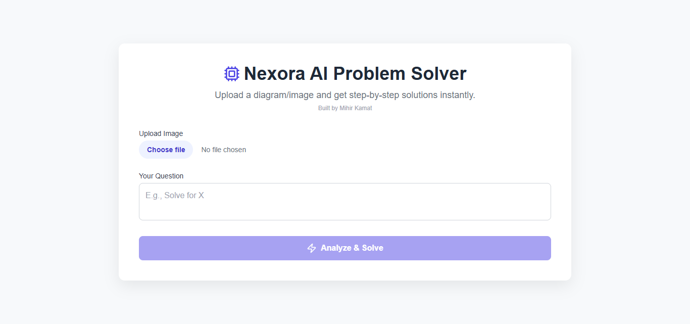

# 🤖 NexoraAI - Your Intelligent Study Companion

**Instant Answers. 24/7 Availability. Smarter Learning.** > An AI-powered educational assistant designed to help students solve doubts, understand complex concepts, and debug code in real-time.

  
   
  <em>NexoraAI Interface</em>

---

## 📖 Table of Contents
- [About the Project](#-about-the-project)
- [Key Features](#-key-features)
- [Tech Stack](#-tech-stack)
- [Future Improvements](#-future-improvements)

---

## 🚀 About the Project

In the middle of late-night study sessions, students often get stuck on difficult concepts with no one to ask. **NexoraAI** bridges this gap.

This project is a web-based AI interface that connects students to a powerful Large Language Model (LLM). Unlike generic chatbots, NexoraAI is tuned for educational queries, providing concise explanations, code debugging, and subject-specific help.

### 💡 The Problem
* Students face delays in resolving doubts outside classroom hours.
* Searching through long documentation or videos is time-consuming.

### ✅ The Solution
A clean, distraction-free interface that provides instant, accurate, and context-aware academic assistance.

---

## ✨ Key Features

* **⚡ Instant Query Resolution:** Get answers to physics problems, coding errors, or theory questions in seconds.
* **💻 Syntax Highlighting:** Cleanly formatted code blocks for programming doubts (Python, C++, Java, web dev).
* **🎨 Distraction-Free UI:** A modern, minimalist dark-mode interface focused purely on learning.
* **📱 Responsive Design:** Works seamlessly on laptops and mobile devices for learning on the go.

---

## 🛠 Tech Stack

* **Frontend:** HTML5, CSS3, JavaScript (ES6+)
* **AI Integration:** OpenAI API (GPT-3.5/4) / Gemini API (*Update this based on what you used*)
* **Styling:** Custom CSS (Flexbox & Grid)
* **Version Control:** Git & GitHub

---

## 🔮 Future Improvements

* [ ] **Voice Input:** Allowing students to ask questions verbally.
* [ ] **Image Recognition:** Uploading photos of math problems for solutions.
* [ ] **History Tab:** Saving past chats for revision.

---

## 👤 Author

**Mihir Kamat** 
* **Role:** Lead Developer  
* **Email:** kamatmihir.cse@gmail.com  
* **GitHub:** [mihirkamat03](https://github.com/mihirkamat03)  
* **LinkedIn:** [mihirkamat](https://linkedin.com/in/mihirkamat)  
